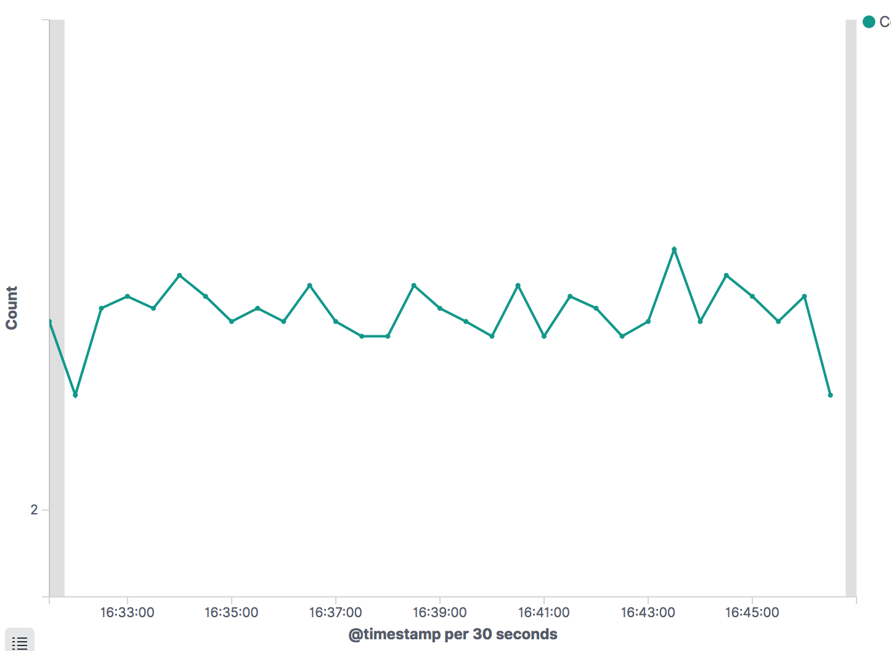

## ELK

ELK = Elasticsearch + Logstash + Kibana

ELK Stack 是实时日志处理领域开源界第一选择。

### Elasticsearch

响应极其快速的分布式搜索引擎中间件。在ELK架构中充当了一个数据库的角色。

```bash
# 启动一个elasticsearch 容器，默认会映射9200端口
# 7.3.1加强了安全设置，需要改变默认参数才能正常运行
docker run -p 9200:9200 -p 9300:9300 -e "discovery.type=single-node" elasticsearch:7.3.1
```

推荐在Chrome 浏览器中安装插件：ElasticSearch Head. 可以方便的进行交互操作。安装插件后可以自动连接默认配置下的Elastic 服务。


### Logstash

Logstash 是一个开源日志收集处理框架
```bash
# 启动一个logstash 容器
docker run logstash:7.3.1
# logstash:5.0镜像的默认参数会自动退出，因为默认配置没有输入源
```

```bash
# 进入container
docker exec -it CONTAINER_ID /bin/bash
```
此步骤也可以使用vs code 中的docker插件实现快捷操作，点击containers 中的具体容器，右键选择*Attach Shell*即可连接该容器的shell。
```bash
bin/logstash -e 'input { stdin { } } output { stdout {} }' --path.data='./data_test/'

# 运行命令后可以在Shell 中输入字符，回车后可以看到如下显示
...
[2019-09-01T09:22:26,411][INFO ][logstash.agent           ] Successfully started Logstash API endpoint {:port=>9601}
hello world
/usr/share/logstash/vendor/bundle/jruby/2.5.0/gems/awesome_print-1.7.0/lib/awesome_print/formatters/base_formatter.rb:31: warning: constant ::Fixnum is deprecated
{
      "@version" => "1",
    "@timestamp" => 2019-09-01T09:22:31.257Z,
          "host" => "66fa5e8dcd97",
       "message" => "hello world"
}
```
**注意：** 必须设置--path.data 参数，以避免和container 本身运行的logstash instance 所使用的./data 文件夹冲突。

### Kibana
Kibana 是一款开源的数据分析和可视化平台。

```bash
# 启动一个kibana容器，默认映射端口5601
docker run kibana
```

## ELK 联合应用

将Python脚本产生的logging通过logstash存入Elastic, 并且通过Kibana 展示。

Python Script logging $\Rightarrow$ Logstash $\Rightarrow$ Elastic  $\Rightarrow$ Kibana

日志生产服务： Python logging 
日志中转服务： Logstash
日志存储服务： Elastic
日志数据分析服务： Kibana

### 日志生产服务
在该模块中，我们每隔随机的时间即打印一个自增的变量，并将该日志发送到Logstash。

```bash
# 为防止版本升级带来的代码失效，指定特定版本的包
pip install python-logstash==0.4.6
```

```python3.6
import logging
import logstash
import time

host = 'localhost'
port = '5959'

test_logger = logging.getLogger('python-logstash-logger')
test_logger.setLevel(logging.INFO)
test_logger.addHandler(logstash.TCPLogstashHandler(host, port))

for x in range(1000):
    test_logger.info(f'counter is {x} now.')
    time.sleep(0.5+5*random())

```
### Logstash日志中转服务
Logstash 需要修改默认配置为
```bash
input {
  tcp {
    port => 5959 #tcp的端口
    # codec => json#输入的格式为json格式
  }
}
output {
elasticsearch {
    hosts => ["elasticsearch:9200"] #es的地址
    index => "python-message-%{+YYYY.MM.dd}" #存入到es的索引名
        }
  stdout {
    codec => rubydebug
  }
}
```

使用 ./logstash 文件下的Dockerfile 将新的配置文件拷贝到 容器中
```dockerfile
FROM logstash:7.3.1

RUN rm -rf /usr/share/logstash/pipeline/logstash.conf
ADD ./elk-demo-logstash.conf /usr/share/logstash/pipeline/
```

### Elastic 日志存储服务
由于Elastic 启用了安全检查，我们需要修改为单机模式（不修改无法通过初始化检查)。可以通过配置文件实现。

```yml
...
elasticsearch:
  image: elasticsearch:7.3.1
  environment:
   - discovery.type=single-node
  ports:
   - "9200:9200"
...
```

### Kibana 面板数据展示
1. 浏览器进入交互页面
http://localhost:5601/app/kibana#/home?_g=() 
2. 选择绘图的索引数据
http://localhost:5601/app/kibana#/management/kibana/index_pattern?_g=()
3. 设定索引
输入 python-message-  后一路点点点
4. 设定图表类型与数据源
http://localhost:5601/app/kibana#/visualize?_g=()
点击 Create new visualization 按钮, 选择 Line 类型，选择 python-message-* 作为数据源
5. 设定图表元素
点击 Buckets 下 的 Add 按钮，添加 X-axis，聚合方式(aggregation)选择 Data Histogram.
点击Metrics 右上方三角形的 apply change 按钮。

**示例图型**



--- 
参考资料
1. http://docs.flycloud.me/docs/ELKStack/index.html
2. ELK Stack 权威指南
3. [python-logstash](https://github.com/vklochan/python-logstash)
