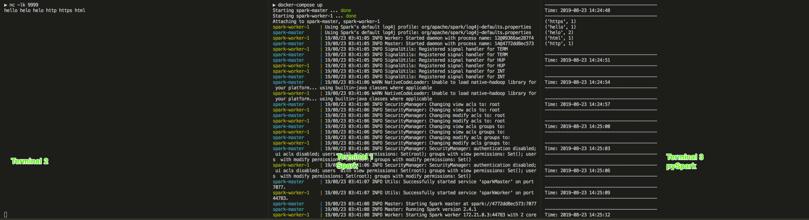

## 简介

Spark Streaming 实时流处理demon。

## 准备

```bash
git clone https://github.com/big-data-europe/docker-spark
```

## Spark Streaming - Word Count
Terminal 1
```bash
#启动Spark集群
cd docker-spark
docker-compose up
```

Terminal 2
```bash
#模拟实时流数据源
nc -lk 9999
```
- Windows 需要单独安装nc 工具。下载地址： https://eternallybored.org/misc/netcat/ 解压后加入系统PATH变量即可。


Terminal 3
```bash
# 连接Spark master
pyspark --master "local[*]"
```

```python
# 进入交互式pyspark 环境，编写流处理代码
from pyspark.streaming import StreamingContext

ssc = StreamingContext(sc, 3)
lines = ssc.socketTextStream("localhost", 9999)
# Split each line into words
words = lines.flatMap(lambda line: line.split(" "))

# Count each word in each batch
pairs = words.map(lambda word: (word, 1))
wordCounts = pairs.reduceByKey(lambda x, y: x + y)

# Print the first ten elements of each RDD generated in this DStream to the console
wordCounts.pprint()

ssc.start()             # Start the computation
ssc.awaitTermination()  # Wait for the computation to terminate

```

## 实验效果

在Terminal 2 中输入字符并回车, Terminal 3 显示分词统计结果



技术文章
[Spark Streaming VS Spark Structured Streaming](https://www.qubole.com/blog/dstreams-vs-dataframes-two-flavors-of-spark-streaming/)

Spark Streaming  Spark 0.7.0 +, at-least-once
Spark Structured Streaming Spark 2.2+, exactly-once

